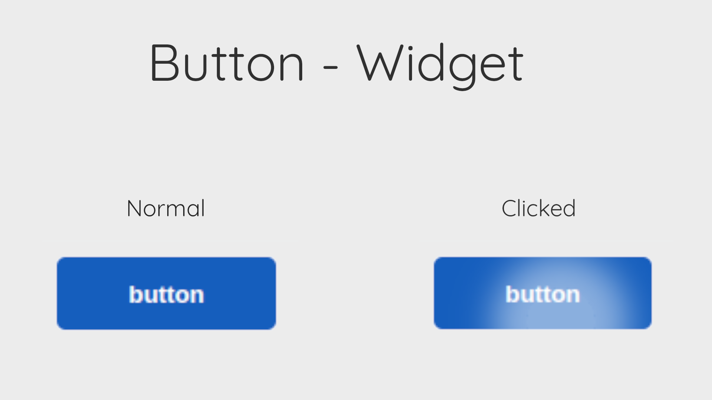

# Mist Mobile Js Framework
Mist mobile js framework is developed for creating Android Native like UI on web applications with the help of web technologies with highly advanced UI Security features. 


## UI Security
UI Security in MIST Mobile is too powerfull because MIST Mobile blocks the direct access to the UI Elements by coating every element with an unique Identifier which can be only accessed via <code>app_data</code> and also MIST Uses DOM (Document Object Manupulation) for not pre rendering the UI but render it once the JavaScript has been loaded. Also MIST Mobile supports the pre rendered html version of the whole UI so it also uses the <code>FOZ DTX COLOR EYE ENCRIPTION</code> for encrypting the whole UI Direct HTML as ASCII characters which are not directly human readable.

## Installation
Please download the MIST Mobile whole repository as zip and then follow the steps.

1.) Download the repository as zip.
2.) Create a new directory containing your html files.
3.) Extract the repository in the root directory of your website.
4.) Include the <code>mist.mobile.js</code> in yout html file where you want to use MIST Mobile JS.
5.) Start by writting code.

## Tutorial for Coding
Okay so now i am hoping that you have already completed the installation process successfully. If yes then let's exlpore the coding for MIST Mobile. If not then install it with the steps shown above the page on Installation section.

### Understanding the Syntax
MIST Mobile has an advanced syntax because it is both beggner friendly but also for some advanced programmers from C/C++ background because MIST Mobile was written in mix of JavaScript and C/C++. Whole Widgets part is written in JavaScript but some backend files are written in C++. Example file IO. Yes MIST Mobile provides a JavaScript way for File Input and Output with the help of Web Assembly (WASM) compiled with Emscripten and C++ but these things are still experinmental and may not work properly.

<b>Starting code</b>
```javascript
/*

    Mist Mobile JS Framework for Website development
    Written by ghgltggamer
    at : 11:36am 19 Aug 2024
    Copyright (c) ghgltggamer
    License : MIT License
    README.md contains all the information about project 
    License file : LICENSE.txt

 */```

These lines are classic lines which defines a comment containing all the information about MIST Mobile JS.

### MIST Mobile Config
MIST Mobile Config is an object contains all the information about the MIST Mobile Current version you are using

Here is how this object looks like
```javascript
// Configuration of MIST Mobile
const MIST_Mobile_Config = {
    Version: 1.0,
    Name: "Mist Mobile JS Framework",
    Author: "GHGL TG GAMER",
    Author_Contacts: {
        YouTube: "https://www.youtube.com/@ghgltggamer/",
        SocialCounts: "https://socialcounts.org/youtube-live-subscriber-count/UCr18zQWXLPyXArqlW8g3ytw/embed"
    },
    Author_Contacts_Platforms: ["YouTube", "SocialCounts"],
    VersionName: "Lumpit-Lumkit",
    VersionStatus: "Completed",
    License: "MIT License",
    License_Type: "FIle",
    License_FIle: "LICENSE.txt",
    Readme: "README.md"
}
```
Information:- 
    Version: Tells the current version of MIST Mobile you are using.
    Name: Tells the full name of MIST Mobile you are using.
    Author: Tells the author name
    Author_Contacts_Platforms: Returns an array containing all the names of those platforms where you can contact the author
    Author_Contacts: Is an object containing all the links to the platforms where the author can be contacted
    VersionName: Tells the name of the MIST Mobile version you are using
    VersionStatus: Tells the version status of development this could be ['Completed', 'Beta', 'Expernimental']
    License: Tellsabout which license has been used
    License_Type: Tells about license type which could be ['FIle', 'embeded']
    License_FIle: If License_Type is FIle and this will eligible for accessed and tell the license file name but if not then this will simply don not do anything.
    Readme: Tell you the name of readme file from which you are learning about MIST Mobile.


### Widgets
WIdgets are one of the most important topics in MIST Mobile UI Framework becayse they are designed for making Android like UI on web with JavaScript. You can also use MIST Mobile Widgets for creating your own widgets with ease.

<b>Why would i learn MIST Mobile Widgets? </b>
You should learn widgets in MIST Mobile because these are designed to simplify the development process. for example you are creating an Android App and you want Android Native Style button if you implement it yourself then it would take you a lot of time and effort but with MIST Mobile Widgets just with few lines of code you can build and even re-use your own widgets with ease.

<b>Widgets types</b>
MIST Mobile contains 2 types of widgets .
1.) MIST MOBILE Native
2.) MIST MOBILE External

<b>MIST MOBILE Native</b>: These widgets types are already comes builtin with MIST Mobile and these are so powerfull and versatile widgets which allows you to re use them also.

<b>MIST MOBILE External</b>: These widgets types are not builtin with MIST Mobile exept these widgets needed to be downloaded or create by self,

### Deep Diving into MIST Mobile Widgets
Okay so as you now has theory of Widgets of MIST Mobile now let's start by developing your application with MIST Mobile Powerfull Native Widgets.


### MIST_Mobile_Widgets [class]
<code> MIST_Mobile_Widgets </code>  contains all of the widgets in an order which prevents the naming conflicts. You would need to define this class before accessing any widget othervise you will not be able to draw widgets on your application.

<b> Syntax </b>
The syntax follow standard JavaScript syntax which is

const yourwidget = new MIST_Mobile_Widgets;

make it sure to replace "yourwidget" with anything you want and this variable will be responsible to serving you MIST Mobile builtin native widgets.

for Example :
```javascript

// Accessing the widgets inside myWidgets variable , constable is prefered.
const myWidgets = new MIST_Mobile_Widgets;

```


<b> How to access widgets after class defination </b>
It is important to access widgets after the class has been defined within a variable, It's always recommended to create a new constant variable before acessing any widget because every widget method will return so many things which you really need. 

for Example:
```javascript

// Accessing the widgets inside myWidgets variable , constable is prefered.
const myWidgets = new MIST_Mobile_Widgets;

// Ignore the button method for now we will talk about it later
const myButton = myWidgets.button("Click me");
myButton.render(document.body);

```

Please ignore the button widget function as we will discuss about it later but just for now see the format we have used. 

First we initalised the class <code> MIST_Mobile_Widgets </code> in a variable named myWidgets and then we created a new variable for the button we want to create and then we assigned ows initalisation myWidgets with <code>button()</code> widget and then we used our button widget variable to render it in the body of the webpage , Again i am repeating do not be scared or confused with button() for now we will talk about it later in this documentation in depth so do not be worry.


<b>Note: The Widgets are plural becase MIST Mobile has a lot of Native builtin widgets to use as per version defination so do not be confused with widget and widgets while writting code with MIST Mobile, Widgets are always plural</b>


### MIST_Mobile_Init() [function]
<code>MIST_Mobile_Init()</code> is a function of MIST Mobile which is needed to initalise configuration of your Project for example styles, widgets and any other thing you need. 

<b>Syntax</b>:
MIST_Mobile_Init() follows very simple syntax becuse ot just need an initaliser before processing anything and then it initalises the initaliser if valid.

MIST_Mobile_Init(Initaliser);

Make sure to replace the "inisaliser" with actual initaliser othervise it may through errors.

<b>Initalisers</b>:
Okay so you have learned this function but beleave me without initaliser there is not use of this function so why not to know about what you can initalise with it let's dive deep into it , here are the list of initalisers you can parse in this function for initalising anything you want.

1.) MIST_Mobile_Button
2.) MIST_Mobile_Init_Everything

<b>MIST_Mobile_Button</b>: Initalises the MIST Mobile button widget styles which are needed to be initalised othervise you will see errors on console when ever you will try to draw a button widget.

<b>MIST_Mobile_Init_Everything</b>: This initalise every single initaliser you will need in your project but also this will add a lot of load for some time to the cpu and on slower computer computer it can significiantly increase the reloading time of the webpage so if you are making a complex application then using this is recommended as this saves a lot of time but if you are just creating a simple application then you can initalise what every you want line by line.

One example:
```javascript

// Initalising button only
MIST_Mobile_Init(MIST_Mobile_Button);

// Initalising everything
MIST_Mobile_Init(MIST_Mobile_Init_Everything); // This will save your effort to initalising everything line by line yet by adding a lot of load for the cpu

```


### MIST_Mobile_Random() [function]
<code> MIST_Mobile_Random() </code> genrates a complex yet random and unique string which doesnot has a fixed length everytime the page has been reloaded or the function has been called it will generate unique and random complex strings. This method was using in a lot of builtin widgets of MIST Mobile for differentiating the widgets.

<b>Syntax</b>:
As it returns the complex string so you will need a variable to store that string so define a variable the assing this function to it.

const myRandom = MIST_Mobile_Random();

Makesure to replace the "myRandom" name with anything you want.

<b>How does it looks like?</b>
It looks like this
<pre>
    <code>
{get_number: 'MIST_MOBILE_RANDOM_9.8660051817136442.446459747843…408043901447674.21540218049090852.871706712045936', get_number_remove_random: 9.866005181713644, get_number_add_random: ƒ}get_number: "MIST_MOBILE_RANDOM_9.8660051817136442.44645974784321047.3586350601029183.6174832207935256.3611212472150427.6611819602040228.6912032613864752.61013549081757330.090063358094363280.52102005941118131.58331174201182818.5687565734187239.4819498127758385.1455803697692470.239128428982346998.3939270082743027.5936234863306236.2590106797305791.7552689402142230.53673685254697738.598726975948720.7408043901447674.21540218049090852.871706712045936"get_number_add_random: ƒ get_number_add_random(random)get_number_remove_random: 9.866005181713644[[Prototype]]: Object
    </code>
</pre>

<b>Why did it looked like that?</b>
If you are a professional JavaScript programmer then you might have noticed that It retuned an object containing some methods if yes then you are right it looked like this because it was a object renturned.

<b>Methods</b>
Now as you know that MIST_Mobile_Random() never directly returns the random number but once it is called it actually processes the number for you and then provides you some methods to access it. and those are

1.) get_number
2.) get_number_remove_random
3.) get_number_add_random() 

<b>get_number</b>: This is a variable returns the actuall random number which looks like this <code>MIST_MOBILE_RANDOM_2.24027399910744054.0434452436380249.668683602326624.6686803154319831.05474544223679976.6736099420237739.549404707193575.7488296065544335.7926618451807232.2730734819490954.286292510822361.85111340559464658.3637017978920783.47885921801875948.803821124377660.83945116527536227.4863508889964051.32089679615245318.2426718504085387.0117941560518431.73426902341524471.83064900907670146.09060716501556956.122805073537217</code> and this is a complex string not an float value as this contains MIST_MOBILE_RANDOM_ which is an indicator of that it is a MIST_MOBILE_RANDOM type generated alpha numeric string and this has been widely used for developing complex applications. Hut you really do not need to only focus on these because for simpler applications next method is great.

<b>get_number_remove_random</b>: This is another variable which contains the floating point value of the number looks like this <code>9.473919755176343</code> a large floating point value right but this is actually usefull and used many times for applications with <code>Math.floor</code> method as it only generated random but large floating point values in between 0 to 10.

<b>get_number_add_random()</b>: This method allows you add your own Random starting point to the final number which will be replaced with "MIST_MOBILE_RANDOM_" string and i can not show you the output for this because it needs an parameter which will be later used to replacing the random default keywords on starting.

for Example:
```javascript

// Creating a random alphanumeric string
const myString = MIST_Mobile_Random().get_number;

// Creating a random floating point value
const myFloat = MIST_Mobile_Random().get_number_remove_random;

// Creating a random integer 
const myFloat = Math.floor(MIST_Mobile_Random().get_number_remove_random);

// Creating a custom starting random string
const myRandString = MIST_Mobile_Random().get_number_add_random('MyRandom');
// Replace MyRandom with anything you want

```


### Understanding the Widget Fundamental
MIST Mobile has it's own Widget structure and fundamental let's explore those before learning our first MIST Mobile Widget because this is important for any type of application developed with MIST Mobile Widget.

<b>Fundamental</b>
Every single widget and element created with MIST Mobile is both parent and child but independent.

<b>What does it means?</b>
It means that every widget you will draw will be independent means you will have full controll on it even you can manipulate or kill that widget because this is the power which MIST Mobile offers you. Every single widget is also both child and parent means that parent says that you can put anything to parent widgets and the thing you put into it will be child of it and you can put something in that child so that it will become the parent of it but child of it's own parent and the parent widget you drawn will be the child of the document means it follows a tree where everything is both child and parent. but you will have full controll to it.

<b>for Example</b>
You have created a button widget and not it's a child of the document but MIST Mobile allows you to make the button a new parent and put any widget as a children to it. and then you ca directly manipulate all of those with MIST Mobile provided methods for example if you dekete that button then it's children will be also deleted. or you can , add, remove anyt particular children or direct play with root of the button which is the identity of the button from where it can be fully controlled but MIST Mobile not stops till here but it can also give you the access to direct button element where you can easily manipulate and even destroy it. also you can remove all the childrens of that button in seconds.


### button() [method]
<code>button()</code> is a method of the class <code>MIST_Mobile_Widgets</code> which allows the developers to create an Android Native button on web with just few lines of code. A button can be also used to create some interactive applications where user click attention is needed.



<b>Syntax</b>
button() as a member of MIST_Mobile_Widgets class can be only used if the class exists or has been initalised othervise it may not work.
Just use the syntax of javascript like this.

yourclassinit.button();

Make sure to replace the yourclassinit with actuall initalised variable with class MIST_Mobile_Widgets.

Also before writting button do not forget to initalise the button widget for using it othervise the button may not work as expected. For initalising the button widget please use 

```javascript

// Initalising the button widget
MIST_Mobile_Init(MIST_Mobile_Button);

// MIST_Mobile_Init() is used to initalise anything you want which is present inside the MIST Mobile JS Framework in our case we initalised the button widget

```

<b>How to get the name of widget you want to initalise? </b>
Simply follow MIST Mobile Js Framework standard format which is 

"MIST_Mobile_" what you want to initalise ?just write the initaliser name with capitalised format

Example

MIST_Mobile_Button : Because button is Button in capitalised format


<b>Button parameters</b>
the button function takes total 5 arguments as parameters which are needed to create a button, And those are (label, width, height, ripple, click).

label: This is used to define the label or simply the text which will appear on top of the button. (Required)

width: This takes numeric values for defining the default button width. (Optional by default 120)

height: This is same as width but this defines the default height of the button. (Optional by default 40)

ripple: This takes a rgba color code or a vector4 color code for setting the color of the ripple effect which must be applied to button with format 'red, green, blue, alpha' as '0,0,0,1' is range of 0 to 255 where 0 stands for darkest and 255 stands for lightest. (Optional by default ''0, 0, 0, 0.2'')

click: This is used as a callback function when ever the button has been clicked. (Optional by default <code>function(){console.log('MIST MOBILE : The button was clicked!')}</code>) you can also add click function with events of button widget so do not worry if you missed this argument.

<b>button methods</b>
button widget has a lot of methods let's take a look on those

1.) render()
2.) remove()
3.) event()
4.) event().click()
5.) event().mouseDown()
6.) event().mouseUp()
7.) event().mouseLeave()
8.) event.().list()
9.) add_Child()
10.) remove_Child()
11.) remove_Children()
12.) add_Child_From_Id()
13.) remove_Child_From_Id()
1+4.) get_Root()
15.) get_Widget()
16.) hide()
17.) show()

<b> Methods seperated based on there difficulty level</b>

Easy to learn
1.) render()
2.) remove()
3.) hide()
4.) show()

harsh to Learn
5.) event()
6.) event.().list()
7.) event().click()
8.) event().mouseDown()
9.) event().mouseUp()
10.) event().mouseLeave()]


hard to Learn
11.) add_Child()
12.) remove_Child()
13.) remove_Children()
14.) add_Child_From_Id()
15.) remove_Child_From_Id()
16.) get_Root()
17.) get_Widget()

Note : Every single method from these can be used with any widget because this as global methods of MIST Mobile which internally comes with every single widget not only with button but every widget has it's own events() so please use event().list() method to know about which additional methods are present for that widget.

<b>How was the difficulty level ranked?</b>

Easy to learn methods are basicly rendering methods

Harsh to learn methods are events because events are somewhat confusing to begginers

Hard to learn methods are the node structure of MIST Mobile JS Framework which allows manipulations

Explanation:-

Rendering methods are pretty simple to learn because most of them in MIST Mobile do not requires even a single argument and that's why those are easy

Events methods are confusing for beggners because they get confused in between which to choose and how to use

MIST Mobile follows a Node Based structure inspired from the Godot game engine's Node based structure which simplifies the developent process. 

Note : MIST Mobile Js Framework's Node based structure is completly different from Node JS . Node based structure is a widgets management structure which is totaly different from Node JS which is another Framework and runtime environment for server side scripting with JS but Node Based Structure in MIST Mobile JS Framework was developed by MIST Mobile itself written by ghgltggamer officially. do not ne confused in between MIST Mobile JS Framework's Node Based Structure and Node JS these are 2 completly different entities to each other.


<b>Now it's the time to start learning methods of button!!</b>

render(): This method takes  single argument is input which should be a DOM object giving the location to render the button for example it could be the <code>document.body</code> for rendering the button on body or anything else even an element. Render method do not removes the internal content of the parent who is pasred for rendering the button exept render() appends the button inside the parent element.

for Example:
```javascript

// Initalising the button
MIST_Mobile_Init(MIST_Mobile_Button);

// creating a widget
const widget = new MIST_Mobile_Widgets;

// creating a button with 100x30 dimension 
const button = widget.button("Click me", 100, 30); // You can also parse other arguments ripple and click but i do not want to parse them here i would like to remain them default

/*

     If you want to also define ripple and click it would look like this

     const button = widget.button("Click me", 100, 30, '0, 0, 0, 0.5', ()=>{
        console.log("You clicked the button");
     });

*/

// rendering the button inside the body directly
button.render(document.body);

/*

    If you want to render the button in any other element you can parse a selector to this which would look like this 
    button.render(document.getElementById('myElement'));

*/

```


remove(): This methods will remove or simply delete the widget in which it has been used. For a button this will simply delete or remove the button widget completly from the application but as long as the widget is stored in an variable it will be able to re draw with render method.

for Example:
```javascript

// Initalising the button
MIST_Mobile_Init(MIST_Mobile_Button);

// creating a widget
const widget = new MIST_Mobile_Widgets;

// creating a button with 100x30 dimension 
const button = widget.button("Click me", 100, 30); // You can also parse other arguments ripple and click but i do not want to parse them here i would like to remain them default

/*

     If you want to also define ripple and click it would look like this

     const button = widget.button("Click me", 100, 30, '0, 0, 0, 0.5', ()=>{
        console.log("You clicked the button");
     });

*/

// rendering the button inside the body directly
button.render(document.body);

/*

    If you want to render the button in any other element you can parse a selector to this which would look like this 
    button.render(document.getElementById('myElement'));

*/


// Now removing the button
button.remove();

```


show(): This method can only work when the widget has been rendered already then this method just shows the widget if the widget has been hidden. 

hide(): This method can only work when the widget has been rendered already then this method just hides the widget but do not completly removes it from the application.


for Example:
```javascript

// Initalising the button
MIST_Mobile_Init(MIST_Mobile_Button);

// creating a widget
const widget = new MIST_Mobile_Widgets;

// creating a button with 100x30 dimension 
const button = widget.button("Click me", 100, 30); // You can also parse other arguments ripple and click but i do not want to parse them here i would like to remain them default

/*

     If you want to also define ripple and click it would look like this

     const button = widget.button("Click me", 100, 30, '0, 0, 0, 0.5', ()=>{
        console.log("You clicked the button");
     });

*/

// rendering the button inside the body directly
button.render(document.body);

/*

    If you want to render the button in any other element you can parse a selector to this which would look like this 
    button.render(document.getElementById('myElement'));

*/


// Hiding the button
button.hide();

// Showing the widget
button.show();

```

event(): This method is only used for calling events for a widget means this methods reuturns an object containing the events. Usually we uses event().eventname() for calling the event but if you parse this method to a variable then you can access the events for that widgets with that variable

for Example:
```javascript

// Initalising the button
MIST_Mobile_Init(MIST_Mobile_Button);

// creating a widget
const widget = new MIST_Mobile_Widgets;

// creating a button with 100x30 dimension 
const button = widget.button("Click me", 100, 30); // You can also parse other arguments ripple and click but i do not want to parse them here i would like to remain them default

/*

     If you want to also define ripple and click it would look like this

     const button = widget.button("Click me", 100, 30, '0, 0, 0, 0.5', ()=>{
        console.log("You clicked the button");
     });

*/

// rendering the button inside the body directly
button.render(document.body);

/*

    If you want to render the button in any other element you can parse a selector to this which would look like this 
    button.render(document.getElementById('myElement'));

*/

// Calling the click event from the button

button.event().click(()=>{
    console.log("button clicked");
}); 

// Or

// Calling the event from another variable

// assigning the event method to it
const button_Events = button.event();

// now we can call events from button_Events variable
button_Events.click(()=>{
    console.log("button clicked");
});

```


event().list(): This is an event or a event method which returns an fstring of JavaScript which contains all the names of the available events for that widget which you are working with, This can be highly usefull as this is a event which works with every widget and helps developers to determine the available events. Mostly we logs the event().list() in console for better practises but it's a personal choise to use this or not.


event().click(): This is an event or an event method which takes a call back function as an argument and then when ever the button widget recieves a click operation on self then the provided call back function will be fired means the function will be executed, when ever the button recieves clicks. 

for Example:
```javascript

// Initalising the button
MIST_Mobile_Init(MIST_Mobile_Button);

// creating a widget
const widget = new MIST_Mobile_Widgets;

// creating a button with 100x30 dimension 
const button = widget.button("Click me", 100, 30); // You can also parse other arguments ripple and click but i do not want to parse them here i would like to remain them default

/*

     If you want to also define ripple and click it would look like this

     const button = widget.button("Click me", 100, 30, '0, 0, 0, 0.5', ()=>{
        console.log("You clicked the button");
     });

*/

// rendering the button inside the body directly
button.render(document.body);

/*

    If you want to render the button in any other element you can parse a selector to this which would look like this 
    button.render(document.getElementById('myElement'));

*/

//  I want to write helo on console when ever the button has been clicked i can do it by 

button.event().click(()=>{
    console.log("helo");
});

```


event().mouseDown(): This is an event or an event method which takes a call back function as an argument and then when ever the button widget recieves a mouse button pressed but not released action then it fires the function it recieved as callback , Simply it checks weather the mouse button is pressed and holded but not released then it calls the callback function.

for Example:
```javascript

// Initalising the button
MIST_Mobile_Init(MIST_Mobile_Button);

// creating a widget
const widget = new MIST_Mobile_Widgets;

// creating a button with 100x30 dimension 
const button = widget.button("Click me", 100, 30); // You can also parse other arguments ripple and click but i do not want to parse them here i would like to remain them default

/*

     If you want to also define ripple and click it would look like this

     const button = widget.button("Click me", 100, 30, '0, 0, 0, 0.5', ()=>{
        console.log("You clicked the button");
     });

*/

// rendering the button inside the body directly
button.render(document.body);

/*

    If you want to render the button in any other element you can parse a selector to this which would look like this 
    button.render(document.getElementById('myElement'));

*/

//  I want to write helo on console when ever the button recieves mouse press action

button.event().mouseDown(()=>{
    console.log("helo");
});

```


event().mouseUp(): This is an event or an event method which takes a call back function as an argument and then when ever the button widget recieves a mouse button pressed and also released action then it fires the function it recieved as callback , Simply it checks weather the mouse button is pressed and released then it calls the callback function.

for Example:
```javascript

// Initalising the button
MIST_Mobile_Init(MIST_Mobile_Button);

// creating a widget
const widget = new MIST_Mobile_Widgets;

// creating a button with 100x30 dimension 
const button = widget.button("Click me", 100, 30); // You can also parse other arguments ripple and click but i do not want to parse them here i would like to remain them default

/*

     If you want to also define ripple and click it would look like this

     const button = widget.button("Click me", 100, 30, '0, 0, 0, 0.5', ()=>{
        console.log("You clicked the button");
     });

*/

// rendering the button inside the body directly
button.render(document.body);

/*

    If you want to render the button in any other element you can parse a selector to this which would look like this 
    button.render(document.getElementById('myElement'));

*/

//  I want to write helo on console when ever the button recieves mouse press and release action

button.event().mouseUp(()=>{
    console.log("helo");
});

```


event().mouseLeave(): This is an event or an event method which takes a call back function as an argument and then when ever the button widget recieves a mouse exit position the from the position and scale of button then it calls the callback function.

for Example:
```javascript

// Initalising the button
MIST_Mobile_Init(MIST_Mobile_Button);

// creating a widget
const widget = new MIST_Mobile_Widgets;

// creating a button with 100x30 dimension 
const button = widget.button("Click me", 100, 30); // You can also parse other arguments ripple and click but i do not want to parse them here i would like to remain them default

/*

     If you want to also define ripple and click it would look like this

     const button = widget.button("Click me", 100, 30, '0, 0, 0, 0.5', ()=>{
        console.log("You clicked the button");
     });

*/

// rendering the button inside the body directly
button.render(document.body);

/*

    If you want to render the button in any other element you can parse a selector to this which would look like this 
    button.render(document.getElementById('myElement'));

*/

//  I want to write helo on console when ever the button recieves mouse exit

button.event().mouseLeave(()=>{
    console.log("helo");
});

```


Note : mouseUp() and click() works almost the same so it depends on you what you want to use.


Node Structure for manipulation


get_Root(): This method is very powerfull because it directly provides the root access to the element or the node tree which is stored as id but MIST Mobile identities are special and which is why they are known as root. you can use the root access with <code>DOM.getElementById()</code> for manipulating it but do not worry because MIST Mobile provides the full fledged manipulation methods.

for Example:
```javascript

// Initalising the button
MIST_Mobile_Init(MIST_Mobile_Button);

// creating a widget
const widget = new MIST_Mobile_Widgets;

// creating a button with 100x30 dimension 
const button = widget.button("Click me", 100, 30); // You can also parse other arguments ripple and click but i do not want to parse them here i would like to remain them default

/*

     If you want to also define ripple and click it would look like this

     const button = widget.button("Click me", 100, 30, '0, 0, 0, 0.5', ()=>{
        console.log("You clicked the button");
     });

*/

// rendering the button inside the body directly
button.render(document.body);

/*

    If you want to render the button in any other element you can parse a selector to this which would look like this 
    button.render(document.getElementById('myElement'));

*/

//  I want to console log the button widget when ever it has been clicked
button.event().click(()=>{
    console.log(document.getElementById(button.get_Root()));
});

```


get_Widget(): This method returns th whole widget not only root access to it and the widget can be easily used for manipulation purposes.

for Example:
```javascript

// Initalising the button
MIST_Mobile_Init(MIST_Mobile_Button);

// creating a widget
const widget = new MIST_Mobile_Widgets;

// creating a button with 100x30 dimension 
const button = widget.button("Click me", 100, 30); // You can also parse other arguments ripple and click but i do not want to parse them here i would like to remain them default

/*

     If you want to also define ripple and click it would look like this

     const button = widget.button("Click me", 100, 30, '0, 0, 0, 0.5', ()=>{
        console.log("You clicked the button");
     });

*/

// rendering the button inside the body directly
button.render(document.body);

/*

    If you want to render the button in any other element you can parse a selector to this which would look like this 
    button.render(document.getElementById('myElement'));

*/

//  I want to console log the button widget when ever it has been clicked
button.event().click(()=>{
    console.log(button.get_Widget());
});

```


Note : get_Root() is more powerfull and mostly used method as compared to get_Widget() because get_Widget() it self relies on the logic og get_Root().


add_Child(): This method adds a child html element to the current root node and make it a parent node for that child. Simply it will append an child element of javascript to the current widget. the html element must be a valid javascript element and whch must be parsed as an argument to add_Child();


for Example:
```javascript

// Initalising the button
MIST_Mobile_Init(MIST_Mobile_Button);

// creating a widget
const widget = new MIST_Mobile_Widgets;

// creating a button with 100x30 dimension 
const button = widget.button("Click me", 100, 30); // You can also parse other arguments ripple and click but i do not want to parse them here i would like to remain them default

/*

     If you want to also define ripple and click it would look like this

     const button = widget.button("Click me", 100, 30, '0, 0, 0, 0.5', ()=>{
        console.log("You clicked the button");
     });

*/

// rendering the button inside the body directly
button.render(document.body);

/*

    If you want to render the button in any other element you can parse a selector to this which would look like this 
    button.render(document.getElementById('myElement'));

*/

// creating a p element
var p = document.createElement('p');
p.innerText = 'My paragraph';

// adding p to button as a child
button.add_Child(p);

```


remove_Child(): This method does the opposite to append element it deletes or removes the element which has been added as a child to the node. The html element must be a valid javascript element and needed to be parsed as an argument to remove_Child();


for Example
```javascript

// Initalising the button
MIST_Mobile_Init(MIST_Mobile_Button);

// creating a widget
const widget = new MIST_Mobile_Widgets;

// creating a button with 100x30 dimension 
const button = widget.button("Click me", 100, 30); // You can also parse other arguments ripple and click but i do not want to parse them here i would like to remain them default

/*

     If you want to also define ripple and click it would look like this

     const button = widget.button("Click me", 100, 30, '0, 0, 0, 0.5', ()=>{
        console.log("You clicked the button");
     });

*/

// rendering the button inside the body directly
button.render(document.body);

/*

    If you want to render the button in any other element you can parse a selector to this which would look like this 
    button.render(document.getElementById('myElement'));

*/

// creating a p element
var p = document.createElement('p');
p.innerText = 'My paragraph';

// adding p to button as a child
button.add_Child(p);

// removing the p child
button.remove_Child(p);

```


remove_Children(): This method do not takes even a single argument where it deletes all the children of the parent node on which this has been applied. and this is way more powerfull than you may think because this will completly remove all the children of the parent node which will result an empty widget.


for Example
```javascript

// Initalising the button
MIST_Mobile_Init(MIST_Mobile_Button);

// creating a widget
const widget = new MIST_Mobile_Widgets;

// creating a button with 100x30 dimension 
const button = widget.button("Click me", 100, 30); // You can also parse other arguments ripple and click but i do not want to parse them here i would like to remain them default

/*

     If you want to also define ripple and click it would look like this

     const button = widget.button("Click me", 100, 30, '0, 0, 0, 0.5', ()=>{
        console.log("You clicked the button");
     });

*/

// rendering the button inside the body directly
button.render(document.body);

/*

    If you want to render the button in any other element you can parse a selector to this which would look like this 
    button.render(document.getElementById('myElement'));

*/

// creating a p element
var p = document.createElement('p');
p.innerText = 'My paragraph';

// adding p to button as a child
button.add_Child(p);

// removing the p child
button.remove_Children();

```


More powerfull manipulation methods


add_Child_From_Id(): This method is too much powerfull because this method takes a string as the argument which must be the html element id which is applied to the element you want to add as a child of parent node . Do not give <code>document.getElementById()</code> as this method automatically processes the element id it self you just need to provide the id as string to this method and this will move your element to be a child of the parent node.

Note : This method will completly move the orignal element from it's actual location and place it as a child of the parent element.


for Example
```html

<div id="myDiv"> Hellow world </div>

```

```javascript

// Initalising the button
MIST_Mobile_Init(MIST_Mobile_Button);

// creating a widget
const widget = new MIST_Mobile_Widgets;

// creating a button with 100x30 dimension 
const button = widget.button("Click me", 100, 30); // You can also parse other arguments ripple and click but i do not want to parse them here i would like to remain them default

/*

     If you want to also define ripple and click it would look like this

     const button = widget.button("Click me", 100, 30, '0, 0, 0, 0.5', ()=>{
        console.log("You clicked the button");
     });

*/

// rendering the button inside the body directly
button.render(document.body);

/*

    If you want to render the button in any other element you can parse a selector to this which would look like this 
    button.render(document.getElementById('myElement'));

*/

// adding p to button as a child
button.add_Child_From_Id("myDiv");

```


remove_Child_From_Id(): This method is too much powerfull because this method takes a string as the argument which must be the html element id which is applied to the element you want to delete or remove as a child of parent node . Do not give <code>document.getElementById()</code> as this method automatically processes the element id it self you just need to provide the id as string to this method and this will delete your element to be a child of the parent node.

Note : This method will completly removes the orignal element as a child of parent node.


for Example
```html

<div id="myDiv"> Hellow world </div>

```

```javascript

// Initalising the button
MIST_Mobile_Init(MIST_Mobile_Button);

// creating a widget
const widget = new MIST_Mobile_Widgets;

// creating a button with 100x30 dimension 
const button = widget.button("Click me", 100, 30); // You can also parse other arguments ripple and click but i do not want to parse them here i would like to remain them default

/*

     If you want to also define ripple and click it would look like this

     const button = widget.button("Click me", 100, 30, '0, 0, 0, 0.5', ()=>{
        console.log("You clicked the button");
     });

*/

// rendering the button inside the body directly
button.render(document.body);

/*

    If you want to render the button in any other element you can parse a selector to this which would look like this 
    button.render(document.getElementById('myElement'));

*/

// adding p to button as a child
button.remove_Child_From_Id("myDiv");

```

# This readme is not fully completed and will be updated as a solo developer i need some time to fully rewrite this whooe readme file.

# if you want to contribute please do it by creating a pull request
